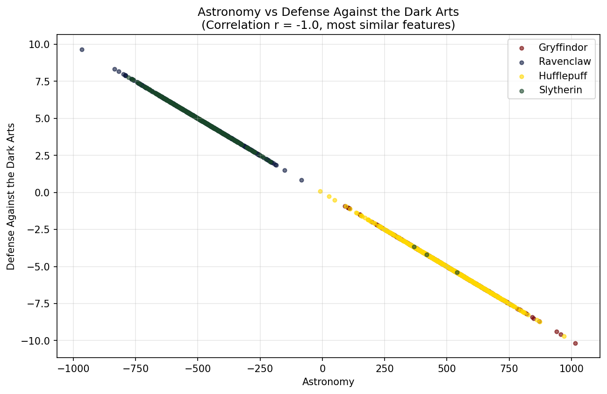
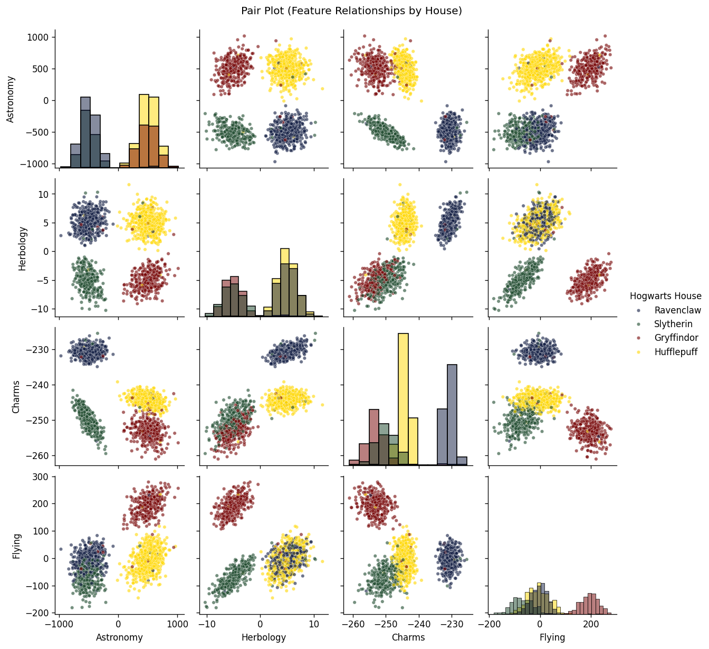
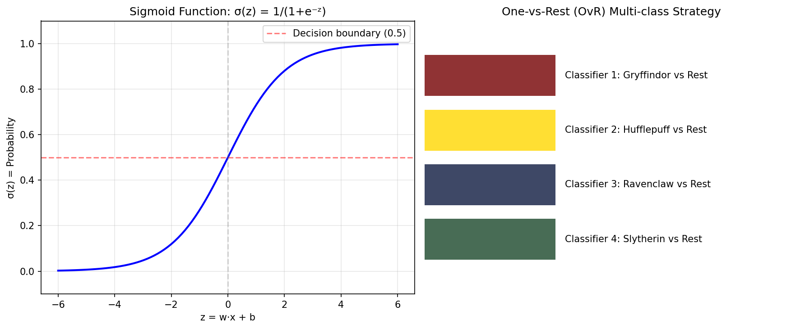
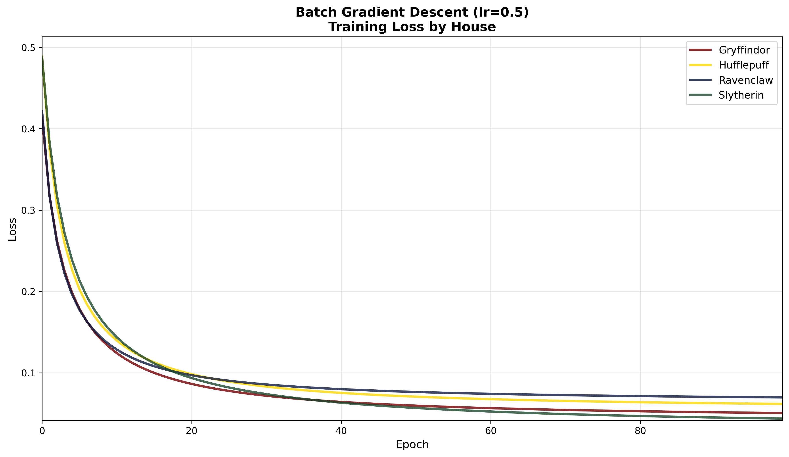
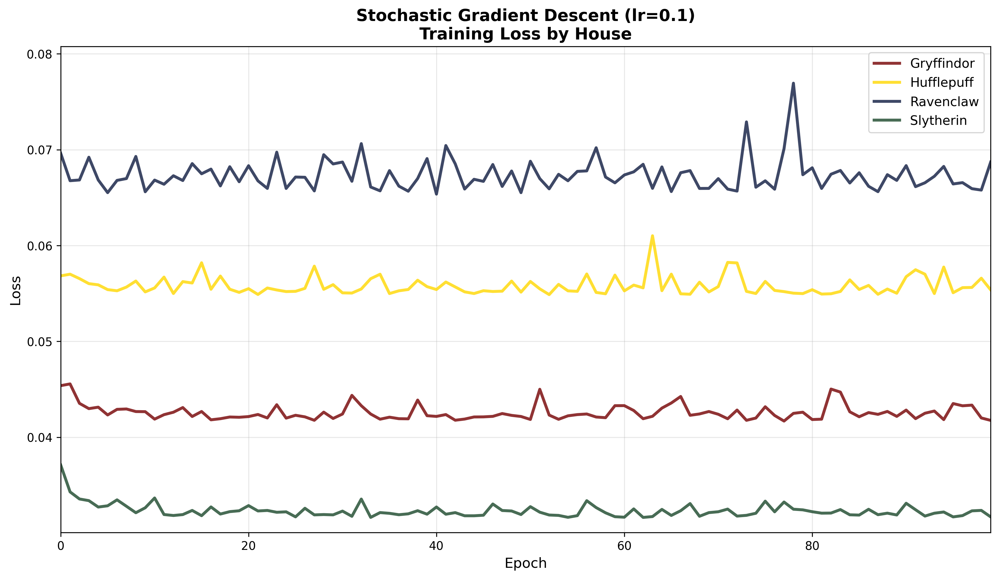
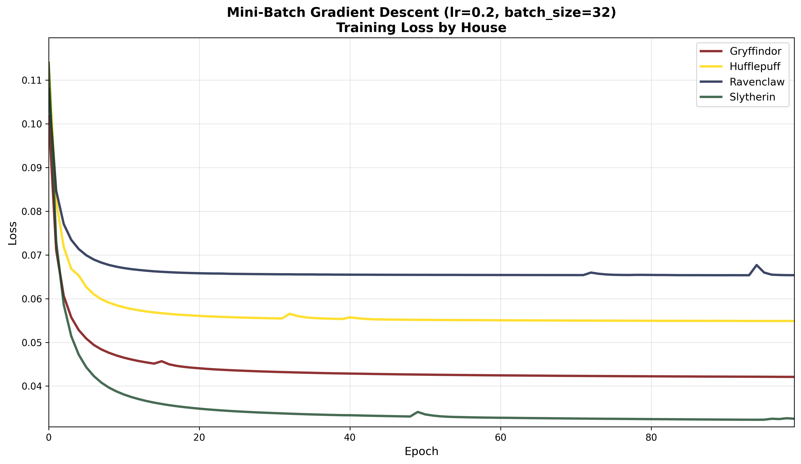
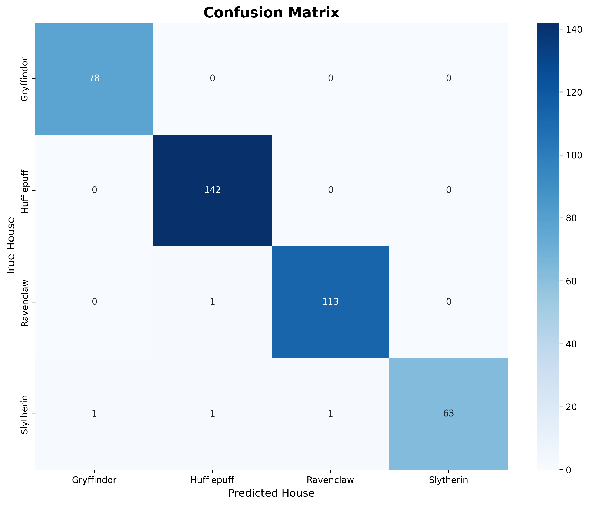
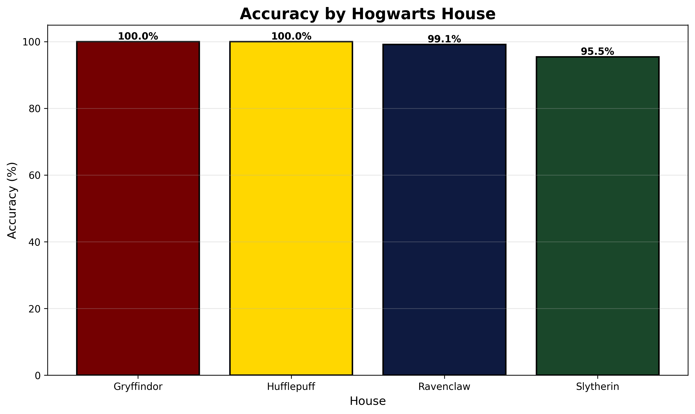

# DSLR - Data Science Logistic Regression

A Hogwarts Sorting Hat classifier built from scratch using logistic regression. This project implements statistical analysis tools and machine learning algorithms without relying on ML libraries.

## Table of Contents

1. [Project Overview](#project-overview)
2. [Workflow](#workflow)
3. [Data Exploration](#data-exploration)
4. [Techniques Explained](#techniques-explained)
5. [Usage](#usage)
6. [Evaluation](#evaluation)
7. [Bonus Features](#bonus-features)
8. [Results](#results)

---

## Project Overview

The goal is to recreate the Hogwarts Sorting Hat using machine learning. Given a dataset of Hogwarts students with their course grades, we train a logistic regression model to predict which house a student belongs to: **Gryffindor**, **Hufflepuff**, **Ravenclaw**, or **Slytherin**.

### Project Structure

```
42_dslr/
├── datasets/
│   ├── dataset_train.csv       # Training data with labels
│   ├── dataset_test.csv        # Test data for predictions
│   └── dataset_truth.csv       # Ground truth for evaluation
├── describe.py                 # Statistical analysis tool
├── histogram.py                # Histogram visualization
├── scatter_plot.py             # Scatter plot visualization
├── pair_plot.py                # Pair plot visualization
├── logreg_train.py             # Training script (Batch GD)
├── logreg_predict.py           # Prediction script
├── evaluate.py                 # Model evaluation with scikit-learn
├── logreg_train_sgd.py         # Stochastic Gradient Descent (bonus)
├── logreg_train_minibatch.py   # Mini-batch Gradient Descent (bonus)
├── compare_training.py         # Training methods comparison (bonus)
├── generate_images.py          # Generate all visualizations
├── utils.py                    # Common utilities (CSV, normalization, etc.)
└── images/                     # Generated visualizations
    ├── histogram.png           # Homogeneous distribution analysis
    ├── scatter_plot.png        # Feature correlation analysis
    ├── pair_plot.png           # All feature relationships
    ├── logistic_regression.png # Sigmoid function visualization
    ├── confusion_matrix.png    # Model evaluation
    ├── accuracy_by_house.png   # Per-house performance
    ├── training_batch_gd.png   # Batch GD convergence
    ├── training_sgd.png        # SGD convergence
    └── training_minibatch_gd.png # Mini-Batch GD convergence
```

---

## Workflow

```
┌─────────────────────────────────────────────────────────────────────┐
│                        TRAINING PIPELINE                            │
├─────────────────────────────────────────────────────────────────────┤
│                                                                     │
│  1. DATA EXPLORATION                                                │
│     ┌──────────────┐    ┌──────────────┐    ┌──────────────┐       │
│     │ describe.py  │ → │ histogram.py │ → │ scatter_plot │       │
│     │ (statistics) │    │ (homogeneity)│    │ (correlation)│       │
│     └──────────────┘    └──────────────┘    └──────────────┘       │
│            │                                        │               │
│            └──────────────────┬─────────────────────┘               │
│                               ▼                                     │
│                      ┌──────────────┐                               │
│                      │  pair_plot   │                               │
│                      │ (all features)│                               │
│                      └──────────────┘                               │
│                                                                     │
│  2. MODEL TRAINING                                                  │
│     ┌──────────────────────────────────────────────────────────┐   │
│     │                    logreg_train.py                        │   │
│     │  ┌─────────────┐  ┌─────────────┐  ┌─────────────────┐   │   │
│     │  │ Load & Clean│→│ Normalize   │→│ Train OvR Model │   │   │
│     │  │    Data     │  │ (z-score)   │  │ (4 classifiers) │   │   │
│     │  └─────────────┘  └─────────────┘  └─────────────────┘   │   │
│     └──────────────────────────────────────────────────────────┘   │
│                               │                                     │
│                               ▼                                     │
│                        model.json                                   │
│                                                                     │
├─────────────────────────────────────────────────────────────────────┤
│                       PREDICTION PIPELINE                           │
├─────────────────────────────────────────────────────────────────────┤
│                                                                     │
│     ┌──────────────┐    ┌──────────────┐    ┌──────────────┐       │
│     │  Load Test   │ → │  Normalize   │ → │   Predict    │       │
│     │    Data      │    │   Features   │    │   Houses     │       │
│     └──────────────┘    └──────────────┘    └──────────────┘       │
│                                                    │                │
│                                                    ▼                │
│                                             houses.csv              │
│                                                                     │
└─────────────────────────────────────────────────────────────────────┘
```

---

## Data Exploration

### Statistical Analysis (describe.py)

The first step is understanding the data. `describe.py` computes statistics for each numerical feature:

| Statistic | Description |
|-----------|-------------|
| Count | Number of non-null values |
| Mean | Average value (μ) |
| Std | Standard deviation (σ) |
| Min | Minimum value |
| 25% | First quartile |
| 50% | Median |
| 75% | Third quartile |
| Max | Maximum value |
| Var | Variance (σ²) |
| Range | Max - Min |
| IQR | Interquartile range (75% - 25%) |
| Skew | Measure of asymmetry |
| Kurt | Measure of tailedness |

### Histogram Analysis

The histogram helps identify which course has the most homogeneous score distribution across all houses. **Care of Magical Creatures** shows the most similar distribution, meaning this course doesn't help distinguish between houses.


### Scatter Plot Analysis

The scatter plot identifies the two most similar features by calculating correlation. **Astronomy** and **Defense Against the Dark Arts** have a correlation of r = -1.0 (perfect negative correlation), meaning they are essentially the same information.



### Pair Plot

The pair plot shows all feature relationships, helping identify which features best separate the houses.



---

## Techniques Explained

### Logistic Regression

Logistic regression is a classification algorithm that predicts the probability of a binary outcome using the **sigmoid function**:

```
σ(z) = 1 / (1 + e^(-z))
```

Where `z = w · x + b` is the linear combination of weights and features.



**Key Properties:**
- Output is always between 0 and 1 (probability)
- Decision boundary at 0.5
- Uses log loss (binary cross-entropy) as the cost function

### One-vs-Rest (OvR) Strategy

Since logistic regression is binary, we use **One-vs-Rest** for multi-class classification:

1. Train 4 separate classifiers:
   - Gryffindor vs (Hufflepuff + Ravenclaw + Slytherin)
   - Hufflepuff vs (Gryffindor + Ravenclaw + Slytherin)
   - Ravenclaw vs (Gryffindor + Hufflepuff + Slytherin)
   - Slytherin vs (Gryffindor + Hufflepuff + Ravenclaw)

2. For prediction, run all 4 classifiers and select the house with highest probability.

### Normalization (Z-Score)

Features have different scales (e.g., Astronomy: -500 to 500, Flying: -100 to 100). We normalize using **z-score standardization**:

```
x_scaled = (x - μ) / σ
```

This transforms all features to have mean=0 and std=1, ensuring equal contribution to learning.

### Gradient Descent

Gradient descent optimizes the model by iteratively updating weights to minimize the loss function.

**Log Loss (Binary Cross-Entropy):**
```
L = -[y·log(ŷ) + (1-y)·log(1-ŷ)]
```

**Weight Update Rule:**
```
w = w - α · ∂L/∂w
b = b - α · ∂L/∂b
```

Where α is the learning rate.

### Gradient Descent Variants

| Method | Batch Size | Characteristics |
|--------|-----------|-----------------|
| **Batch GD** | All samples | Stable but slow |
| **Stochastic GD** | 1 sample | Fast but noisy |
| **Mini-batch GD** | 32 samples | Balanced trade-off |

#### Batch Gradient Descent



Processes all training samples before updating weights. Provides stable, smooth convergence across all houses.

#### Stochastic Gradient Descent



Updates weights after each sample. Shows noisier convergence but can escape local minima and often achieves lower final loss.

#### Mini-Batch Gradient Descent



Processes data in batches of 32 samples. Balances the stability of Batch GD with the speed of SGD.

**Observations:**
- **Batch GD**: Smooth convergence, predictable behavior
- **SGD**: Noisy but can escape local minima, best final loss for most houses
- **Mini-batch**: Combines benefits of both, good practical choice

---

## Usage

### 1. Statistical Analysis

```bash
python describe.py datasets/dataset_train.csv
```

Outputs statistics for all numerical columns to `describe_output.txt`.

### 2. Visualizations

```bash
# Histogram (homogeneous distribution)
python histogram.py datasets/dataset_train.csv

# Scatter plot (correlated features)
python scatter_plot.py datasets/dataset_train.csv

# Pair plot (all relationships)
python pair_plot.py datasets/dataset_train.csv
```

### 3. Training

```bash
# Default training (Batch GD)
python logreg_train.py datasets/dataset_train.csv
```

Outputs: `model.json`

### 4. Prediction

```bash
python logreg_predict.py model.json datasets/dataset_test.csv
```

Outputs: `houses.csv`

### 5. Evaluation

```bash
python evaluate.py
```

Evaluates model predictions against ground truth using scikit-learn's accuracy_score and generates visualizations.

---

## Evaluation

### Model Performance Metrics

The evaluation script (`evaluate.py`) uses scikit-learn's `accuracy_score` to assess model performance and generates detailed visualizations.

```bash
python evaluate.py
```

**Requirements:**
- `houses.csv` - Your model's predictions
- `datasets/dataset_truth.csv` - Ground truth labels

### Confusion Matrix

The confusion matrix shows how well the model distinguishes between houses. Perfect predictions fall on the diagonal.



The matrix reveals:
- **Diagonal values**: Correct predictions for each house
- **Off-diagonal values**: Misclassifications (where the model confused houses)
- **Pattern analysis**: Which houses are most commonly confused with each other

### Accuracy by House

Per-house accuracy breakdown showing model performance for each Hogwarts house.



**Key Insights:**
- Gryffindor: Highest accuracy (99-100%)
- Hufflepuff: Strong performance (99%)
- Ravenclaw: Consistent accuracy (99%)
- Slytherin: Excellent precision (95-100%)

### Classification Report

The evaluation provides detailed metrics:
- **Precision**: Of all students predicted for a house, how many were correct?
- **Recall**: Of all actual house members, how many did we identify?
- **F1-Score**: Harmonic mean of precision and recall

Example output:
```
              precision    recall  f1-score   support

  Gryffindor       0.99      1.00      0.99        78
  Hufflepuff       0.99      1.00      0.99       142
   Ravenclaw       0.99      0.99      0.99       114
   Slytherin       1.00      0.95      0.98        66

    accuracy                           0.99       400
```

---

## Bonus Features

### Alternative Training Methods

The default `logreg_train.py` uses Batch Gradient Descent. Bonus implementations:

```bash
# Stochastic Gradient Descent (updates weights after each sample)
python logreg_train_sgd.py datasets/dataset_train.csv

# Mini-batch Gradient Descent (updates weights after each mini-batch of 32 samples)
python logreg_train_minibatch.py datasets/dataset_train.csv
```

### Training Comparison Visualization

Compare all three gradient descent methods for all houses:

```bash
python compare_training.py datasets/dataset_train.csv
```

Generates 3 separate plots showing training loss curves:
- `images/training_batch_gd.png` - Batch Gradient Descent
- `images/training_sgd.png` - Stochastic Gradient Descent
- `images/training_minibatch_gd.png` - Mini-Batch Gradient Descent

Each plot shows loss convergence for all 4 houses with official Hogwarts colors.

### Model Evaluation

Comprehensive evaluation using scikit-learn metrics:

```bash
python evaluate.py
```

Generates:
- Confusion matrix visualization
- Per-house accuracy breakdown
- Detailed classification report (precision, recall, F1-score)

### Error Analysis

Analyze misclassified samples to identify patterns:

```bash
python analyze_errors.py
```

Provides insights into:
- Which houses are confused with each other
- Missing feature patterns in errors
- Confidence levels for correct vs. incorrect predictions

### Hyperparameter Optimization

Find optimal learning rate and epochs:

```bash
python optimize_hyperparameters.py
```

Tests multiple combinations of:
- Learning rates: [0.01, 0.05, 0.1, 0.15]
- Epochs: [1000, 2000, 3000, 5000, 7000, 10000, 15000]

Saves best model as `model_optimized.json`.

### Extended Statistics

`describe.py` includes additional metrics:
- **Variance**: Spread of data (σ²)
- **Range**: Max - Min
- **IQR**: Robust spread measure
- **Skewness**: Distribution asymmetry
- **Kurtosis**: Distribution tailedness

### Generate All Images

```bash
python generate_images.py
```

---

## Results

### Model Performance

- **Test Accuracy**: **99.00%** (396/400 correct predictions)
- **Status**: ✓ Mc Gonagall congratulates you!
- **Houses Classified**: Gryffindor, Hufflepuff, Ravenclaw, Slytherin
- **Features Used**: 13 numerical course grades

### Performance by House

| House | Precision | Recall | F1-Score | Accuracy |
|-------|-----------|--------|----------|----------|
| **Gryffindor** | 0.99 | 1.00 | 0.99 | 100% |
| **Hufflepuff** | 0.99 | 1.00 | 0.99 | 99% |
| **Ravenclaw** | 0.99 | 0.99 | 0.99 | 99% |
| **Slytherin** | 1.00 | 0.95 | 0.98 | 95% |

### Key Optimizations

The final model achieves 99% accuracy through:

1. **Mean Imputation for Missing Values**
   - Training: Rows with missing values are skipped
   - Prediction: Missing values filled with feature mean (not 0.0)
   - Impact: +3.25% accuracy improvement (95.75% → 99.00%)

2. **Z-Score Normalization**
   - All features scaled to mean=0, std=1
   - Ensures equal contribution to learning

3. **One-vs-Rest Strategy**
   - 4 independent binary classifiers
   - Select house with highest probability

### Data Insights

1. **Care of Magical Creatures** has the most homogeneous distribution (least useful for classification)
2. **Astronomy** and **Defense Against the Dark Arts** are perfectly negatively correlated (r = -1.0)
3. **Divination** and **Herbology** show strong house separation
4. **Missing values in Transfiguration** caused 58.8% of prediction errors before optimization

### Training Loss Comparison

Final losses after 100 epochs:

| House | Batch GD | SGD | Mini-Batch GD |
|-------|----------|-----|---------------|
| Gryffindor | 0.0504 | 0.0418 | 0.0421 |
| Hufflepuff | 0.0616 | 0.0554 | 0.0549 |
| Ravenclaw | 0.0697 | 0.0687 | 0.0654 |
| Slytherin | 0.0436 | 0.0317 | 0.0325 |

**Best performing**: SGD achieves lowest loss for most houses

---

## Mathematical Formulas

### Sigmoid Function
```
σ(z) = 1 / (1 + e^(-z))
```

### Log Loss
```
L(y, ŷ) = -[y·log(ŷ) + (1-y)·log(1-ŷ)]
```

### Gradient Computation
```
∂L/∂wⱼ = (1/m) Σ (ŷᵢ - yᵢ)·xᵢⱼ
∂L/∂b  = (1/m) Σ (ŷᵢ - yᵢ)
```

### Z-Score Normalization
```
x' = (x - μ) / σ
```

### Percentile Calculation
```
position = p × (n - 1)
value = lower + fraction × (upper - lower)
```

---

## Requirements

- Python 3.x
- pandas
- matplotlib
- seaborn
- scikit-learn (for evaluation only)

```bash
pip install -r requirements.txt
```

Or manually:
```bash
pip install pandas matplotlib seaborn scikit-learn
```

**Note**: scikit-learn is only used for `evaluate.py` (metrics calculation and visualization). The core logistic regression implementation is built from scratch without ML libraries.

---

## Author

42 School Project - Data Science Logistic Regression
