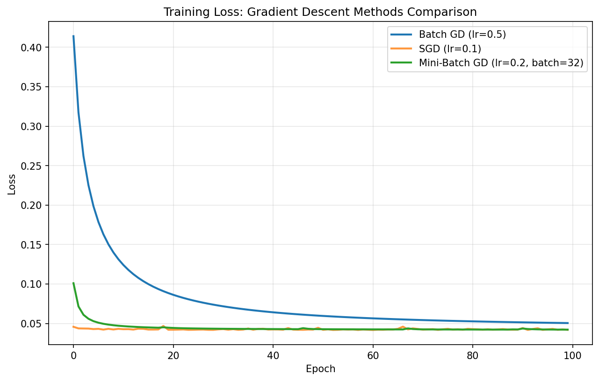

# DSLR - Data Science Logistic Regression

A Hogwarts Sorting Hat classifier built from scratch using logistic regression. This project implements statistical analysis tools and machine learning algorithms without relying on ML libraries.

## Table of Contents

1. [Project Overview](#project-overview)
2. [Workflow](#workflow)
3. [Data Exploration](#data-exploration)
4. [Techniques Explained](#techniques-explained)
5. [Usage](#usage)
6. [Bonus Features](#bonus-features)
7. [Results](#results)

---

## Project Overview

The goal is to recreate the Hogwarts Sorting Hat using machine learning. Given a dataset of Hogwarts students with their course grades, we train a logistic regression model to predict which house a student belongs to: **Gryffindor**, **Hufflepuff**, **Ravenclaw**, or **Slytherin**.

### Project Structure

```
42_dslr/
├── datasets/
│   ├── dataset_train.csv    # Training data with labels
│   └── dataset_test.csv     # Test data for predictions
├── describe.py              # Statistical analysis tool
├── histogram.py             # Histogram visualization
├── scatter_plot.py          # Scatter plot visualization
├── pair_plot.py             # Pair plot visualization
├── logreg_train.py          # Training script (Batch GD)
├── logreg_predict.py        # Prediction script
├── logreg_train_sgd.py      # Stochastic Gradient Descent (bonus)
├── logreg_train_minibatch.py # Mini-batch Gradient Descent (bonus)
├── compare_training.py      # Training methods comparison (bonus)
├── utils.py                 # CSV parsing utilities
└── images/                  # Generated visualizations
```

---

## Workflow

```
┌─────────────────────────────────────────────────────────────────────┐
│                        TRAINING PIPELINE                            │
├─────────────────────────────────────────────────────────────────────┤
│                                                                     │
│  1. DATA EXPLORATION                                                │
│     ┌──────────────┐    ┌──────────────┐    ┌──────────────┐       │
│     │ describe.py  │ → │ histogram.py │ → │ scatter_plot │       │
│     │ (statistics) │    │ (homogeneity)│    │ (correlation)│       │
│     └──────────────┘    └──────────────┘    └──────────────┘       │
│            │                                        │               │
│            └──────────────────┬─────────────────────┘               │
│                               ▼                                     │
│                      ┌──────────────┐                               │
│                      │  pair_plot   │                               │
│                      │ (all features)│                               │
│                      └──────────────┘                               │
│                                                                     │
│  2. MODEL TRAINING                                                  │
│     ┌──────────────────────────────────────────────────────────┐   │
│     │                    logreg_train.py                        │   │
│     │  ┌─────────────┐  ┌─────────────┐  ┌─────────────────┐   │   │
│     │  │ Load & Clean│→│ Normalize   │→│ Train OvR Model │   │   │
│     │  │    Data     │  │ (z-score)   │  │ (4 classifiers) │   │   │
│     │  └─────────────┘  └─────────────┘  └─────────────────┘   │   │
│     └──────────────────────────────────────────────────────────┘   │
│                               │                                     │
│                               ▼                                     │
│                        model.json                                   │
│                                                                     │
├─────────────────────────────────────────────────────────────────────┤
│                       PREDICTION PIPELINE                           │
├─────────────────────────────────────────────────────────────────────┤
│                                                                     │
│     ┌──────────────┐    ┌──────────────┐    ┌──────────────┐       │
│     │  Load Test   │ → │  Normalize   │ → │   Predict    │       │
│     │    Data      │    │   Features   │    │   Houses     │       │
│     └──────────────┘    └──────────────┘    └──────────────┘       │
│                                                    │                │
│                                                    ▼                │
│                                             houses.csv              │
│                                                                     │
└─────────────────────────────────────────────────────────────────────┘
```

---

## Data Exploration

### Statistical Analysis (describe.py)

The first step is understanding the data. `describe.py` computes statistics for each numerical feature:

| Statistic | Description |
|-----------|-------------|
| Count | Number of non-null values |
| Mean | Average value (μ) |
| Std | Standard deviation (σ) |
| Min | Minimum value |
| 25% | First quartile |
| 50% | Median |
| 75% | Third quartile |
| Max | Maximum value |
| Var | Variance (σ²) |
| Range | Max - Min |
| IQR | Interquartile range (75% - 25%) |
| Skew | Measure of asymmetry |
| Kurt | Measure of tailedness |

### Histogram Analysis

The histogram helps identify which course has the most homogeneous score distribution across all houses. **Care of Magical Creatures** shows the most similar distribution, meaning this course doesn't help distinguish between houses.


### Scatter Plot Analysis

The scatter plot identifies the two most similar features by calculating correlation. **Astronomy** and **Defense Against the Dark Arts** have a correlation of r = -1.0 (perfect negative correlation), meaning they are essentially the same information.


### Pair Plot

The pair plot shows all feature relationships, helping identify which features best separate the houses.


---

## Techniques Explained

### Logistic Regression

Logistic regression is a classification algorithm that predicts the probability of a binary outcome using the **sigmoid function**:

```
σ(z) = 1 / (1 + e^(-z))
```

Where `z = w · x + b` is the linear combination of weights and features.


**Key Properties:**
- Output is always between 0 and 1 (probability)
- Decision boundary at 0.5
- Uses log loss (binary cross-entropy) as the cost function

### One-vs-Rest (OvR) Strategy

Since logistic regression is binary, we use **One-vs-Rest** for multi-class classification:

1. Train 4 separate classifiers:
   - Gryffindor vs (Hufflepuff + Ravenclaw + Slytherin)
   - Hufflepuff vs (Gryffindor + Ravenclaw + Slytherin)
   - Ravenclaw vs (Gryffindor + Hufflepuff + Slytherin)
   - Slytherin vs (Gryffindor + Hufflepuff + Ravenclaw)

2. For prediction, run all 4 classifiers and select the house with highest probability.

### Normalization (Z-Score)

Features have different scales (e.g., Astronomy: -500 to 500, Flying: -100 to 100). We normalize using **z-score standardization**:

```
x_scaled = (x - μ) / σ
```

This transforms all features to have mean=0 and std=1, ensuring equal contribution to learning.

### Gradient Descent

Gradient descent optimizes the model by iteratively updating weights to minimize the loss function.

**Log Loss (Binary Cross-Entropy):**
```
L = -[y·log(ŷ) + (1-y)·log(1-ŷ)]
```

**Weight Update Rule:**
```
w = w - α · ∂L/∂w
b = b - α · ∂L/∂b
```

Where α is the learning rate.

### Gradient Descent Variants

| Method | Batch Size | Characteristics |
|--------|-----------|-----------------|
| **Batch GD** | All samples | Stable but slow |
| **Stochastic GD** | 1 sample | Fast but noisy |
| **Mini-batch GD** | 32 samples | Balanced trade-off |



**Observations:**
- **Batch GD**: Smooth convergence, predictable behavior
- **SGD**: Noisy but can escape local minima
- **Mini-batch**: Combines benefits of both

---

## Usage

### 1. Statistical Analysis

```bash
python describe.py datasets/dataset_train.csv
```

Outputs statistics for all numerical columns to `describe_output.txt`.

### 2. Visualizations

```bash
# Histogram (homogeneous distribution)
python histogram.py datasets/dataset_train.csv

# Scatter plot (correlated features)
python scatter_plot.py datasets/dataset_train.csv

# Pair plot (all relationships)
python pair_plot.py datasets/dataset_train.csv
```

### 3. Training

```bash
# Default training (Batch GD)
python logreg_train.py datasets/dataset_train.csv
```

Outputs: `model.json`

### 4. Prediction

```bash
python logreg_predict.py model.json datasets/dataset_test.csv
```

Outputs: `houses.csv`

---

## Bonus Features

### Alternative Training Methods

The default `logreg_train.py` uses Batch Gradient Descent. Bonus implementations:

```bash
# Stochastic Gradient Descent (updates weights after each sample)
python logreg_train_sgd.py datasets/dataset_train.csv

# Mini-batch Gradient Descent (updates weights after each mini-batch of 32 samples)
python logreg_train_minibatch.py datasets/dataset_train.csv
```

### Training Comparison Visualization

```bash
python compare_training.py datasets/dataset_train.csv
```

### Extended Statistics

`describe.py` includes additional metrics:
- **Variance**: Spread of data (σ²)
- **Range**: Max - Min
- **IQR**: Robust spread measure
- **Skewness**: Distribution asymmetry
- **Kurtosis**: Distribution tailedness

### Generate All Images

```bash
python generate_images.py
```

---

## Results

### Model Performance

- **Training Accuracy**: ~98%
- **Houses Classified**: Gryffindor, Hufflepuff, Ravenclaw, Slytherin
- **Features Used**: 13 numerical course grades

### Key Findings

1. **Care of Magical Creatures** has the most homogeneous distribution (least useful for classification)
2. **Astronomy** and **Defense Against the Dark Arts** are perfectly negatively correlated (r = -1.0)
3. **Divination** and **Herbology** show strong house separation

---

## Mathematical Formulas

### Sigmoid Function
```
σ(z) = 1 / (1 + e^(-z))
```

### Log Loss
```
L(y, ŷ) = -[y·log(ŷ) + (1-y)·log(1-ŷ)]
```

### Gradient Computation
```
∂L/∂wⱼ = (1/m) Σ (ŷᵢ - yᵢ)·xᵢⱼ
∂L/∂b  = (1/m) Σ (ŷᵢ - yᵢ)
```

### Z-Score Normalization
```
x' = (x - μ) / σ
```

### Percentile Calculation
```
position = p × (n - 1)
value = lower + fraction × (upper - lower)
```

---

## Requirements

- Python 3.x
- pandas
- matplotlib
- seaborn

```bash
pip install pandas matplotlib seaborn
```

---

## Author

42 School Project - Data Science Logistic Regression
